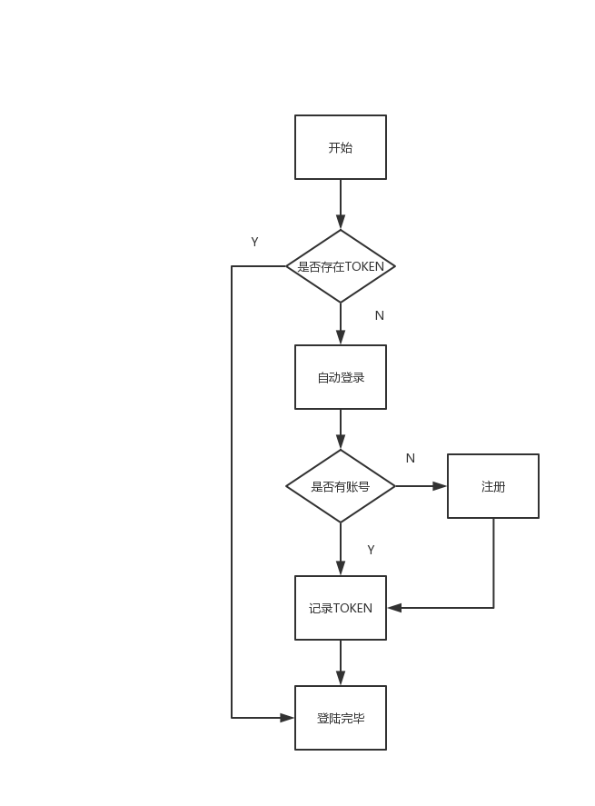

# 登录模块

`Uniapp` 支持打包成各种小程序，但我们暂时只支持 微信小程序，所以代码设计中，暂不考虑其他情况。

## 创建用户表

```SQL
CREATE TABLE `users` (
  `id` bigint(11) unsigned NOT NULL AUTO_INCREMENT,
  `nickname` varchar(256) NOT NULL DEFAULT '' COMMENT '昵称',
  `avatar` varchar(256) NOT NULL DEFAULT '' COMMENT '头像',
  `gender` tinyint(3) unsigned NOT NULL DEFAULT '0' COMMENT '1男',
  `openid` varchar(64) NOT NULL DEFAULT '' COMMENT 'OPENID',
  `created_at` datetime DEFAULT NULL,
  `updated_at` datetime DEFAULT NULL,
  PRIMARY KEY (`id`),
  UNIQUE KEY `UNIQUE_OPENID` (`openid`)
) ENGINE=InnoDB AUTO_INCREMENT=5 DEFAULT CHARSET=utf8mb4 COMMENT='用户表';
```

## 创建模型

```php
<?php

declare (strict_types=1);
/**
 * This file is part of Hyperf.
 *
 * @link     https://www.hyperf.io
 * @document https://doc.hyperf.io
 * @contact  group@hyperf.io
 * @license  https://github.com/hyperf-cloud/hyperf/blob/master/LICENSE
 */
namespace App\Model;

/**
 * @property int $id
 * @property string $nickname
 * @property string $avatar
 * @property int $gender
 * @property string $openid
 * @property \Carbon\Carbon $created_at
 * @property \Carbon\Carbon $updated_at
 */
class User extends Model
{
    /**
     * The table associated with the model.
     *
     * @var string
     */
    protected $table = 'users';
    /**
     * The attributes that are mass assignable.
     *
     * @var array
     */
    protected $fillable = ['id', 'nickname', 'avatar', 'gender', 'openid', 'created_at', 'updated_at'];
    /**
     * The attributes that should be cast to native types.
     *
     * @var array
     */
    protected $casts = ['id' => 'integer', 'gender' => 'integer', 'created_at' => 'datetime', 'updated_at' => 'datetime'];
}
```

## 登录流程



## 用户注册

增加对应路由

config.php

```
Router::post('/regist', 'App\Controller\UserController@regist');
```

